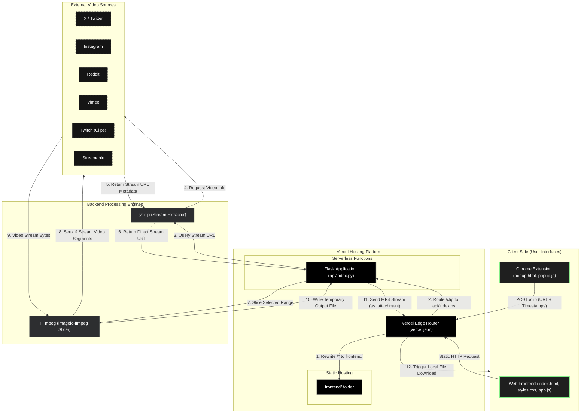

# ClipGrab
- A fast and simple video clipper for YouTube, X, Instagram, and more.
- Just paste a link, optionally select a start and end time, and download the exact clip you need.
- The Chrome extension auto-detects videos from your current tab to make clipping even faster.

<video src="https://github.com/user-attachments/assets/6212ee20-2571-4ea4-bcfe-077f26aba9e2" width="100%" controls></video>

## Supported Platforms

- **X / Twitter**
- **Instagram**
- **Reddit**
- **Vimeo**
- **Twitch** (clips)
- **Streamable**

## How It Works

1. You paste a video URL on the website.
2. The Python backend uses **yt-dlp** to extract the direct stream URL.
3. **FFmpeg** (via `imageio-ffmpeg`) slices the requested time range.
4. The clipped video is streamed back to your browser as a download.

## System Architecture



## Run Locally

```bash
git clone https://github.com/Arav-Arun/ClipGrab.git
cd ClipGrab
pip3 install -r requirements.txt
python3 api/index.py
```

Open `http://localhost:9000`.

## Chrome Extension

The extension auto-detects video URLs from your current tab for one-click clipping.

**To install locally:**

1. Go to `chrome://extensions/`.
2. Enable **Developer mode** (top-right).
3. Click **Load unpacked** → select the `frontend/extension/` folder.
4. Pin it to your toolbar.
